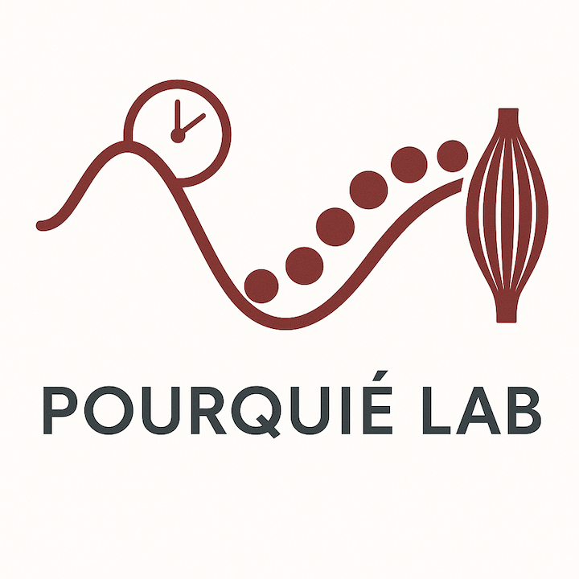

  
  
  

## Pourquie Lab @Harvard Medical School & Brigham and Women's Hospital 
60 Fenwood Rd, Boston, MA 02115

### Welcome to the Pourquie Lab!
The Pourquié Lab at Harvard Medical School is led by [Olivier Pourquie](https://www.hsci.harvard.edu/people/olivier-pourquie-phd). We explore the fundamental processes that govern vertebrate embryonic development, with a particular focus on somitogenesis—the formation of segmented structures along the body axis—and the development of skeletal muscle. The lab studies how the segmentation clock, a molecular oscillator, coordinates the rhythmic production of somites, which later give rise to vertebrae, skeletal muscle, and dermis.

In addition to uncovering the molecular and cellular mechanisms of somite formation, the lab investigates how these structures differentiate into muscle progenitors and how muscle tissues are patterned and specified during development. This work provides insight into both normal musculoskeletal development and congenital disorders affecting the spine and musculature.

The Pourquié Lab is also a leader in developing human in vitro models of embryonic development, including Somitoids, stem cell-derived organoids that recapitulate aspects of the segmentation clock and musculoskeletal lineage specification. Using tools from genetics, stem cell biology, live imaging, and bioengineering, the lab aims to dissect the spatiotemporal control of tissue patterning, morphogenesis, and differentiation in both mouse and human systems.

